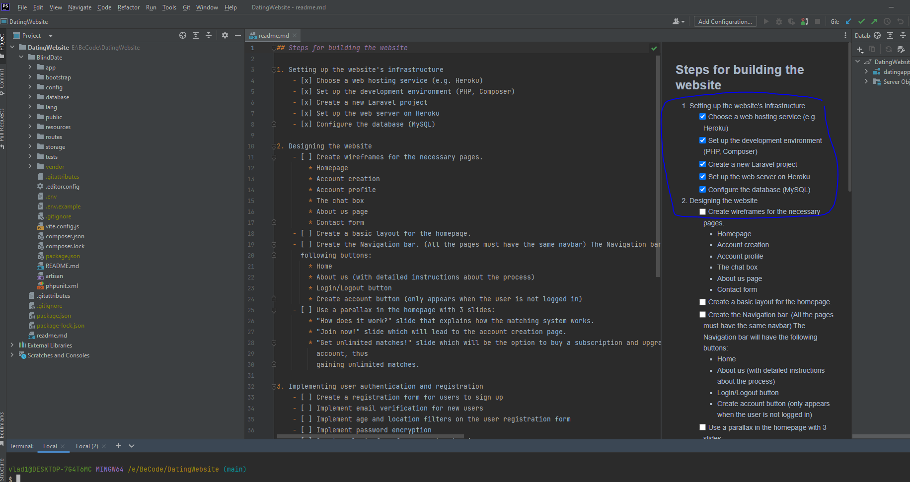

## Steps for building the website

1. Setting up the website's infrastructure
    - [x] Choose a web hosting service (e.g. Heroku)
    - [x] Set up the development environment (PHP, Composer)
    - [x] Create a new Laravel project
    - [x] Set up the web server on Heroku
    - [x] Configure the database (MySQL)

2. Designing the website
    - [x] Create wireframes for the necessary pages.
        * Homepage
        * Dashboard
        * Account creation
        * Account profile
        * The chat box
        * About us page
        * Contact form
    - [ ] Create user stories
    - [ ] Create a basic layout for the homepage.
    - [ ] Create the Navigation bar. (All the pages must have the same navbar) The Navigation bar will have the
      following buttons:
        * Home
        * About us (with detailed instructions about the process)
        * Login/Logout button
        * Create account button (only appears when the user is not logged in)
    - [ ] Use a parallax in the homepage with 3 slides:
        * "How does it work?" slide that explains how the matching system works.
        * "Join now!" slide which will lead to the account creation page.
        * "Get unlimited matches!" slide which will be the option to buy a subscription and upgrade your
          account, thus
          gaining unlimited matches.

3. Implementing user authentication and registration
    - [ ] Create a registration form for users to sign up
    - [ ] Implement email verification for new users
    - [ ] Implement age and location filters on the user registration form
    - [ ] Implement password encryption
    - [ ] Create a login form for users to sign in
    - [ ] Implement password reset functionality
    - [ ] Add terms of service to make sure the users are legal adults

4. Implementing the "Go on a Blind Date" feature
    - [ ] Shuffle all the active users and connect 2 random people together in one chat room
    - [ ] Add a chat box with a text feature
    - [ ] Add a voice call or short voice message feature to the chat box
    - [ ] Implement a limit of 3 matches per day for free users
    - [ ] Implement a VIP subscription to increase the match limit

5. Implementing additional features
    - [ ] Add a chat filter to mask bad words or eventually ban people who use bad words
    - [ ] Add a "Matched with" section that shows everyone you matched with, but no pictures, just their names and when
      you click on their name you can re-open the chat
    - [ ] Website needs to be responsive
    - [ ] Register a domain name
    - [ ] Point the domain name to the Heroku server's IP address

### Note: This is a work in progress, and as such, I will continuously update this file.
### Thoughts: After logging in, send the user to a dashboard where they have access to all the options available on the website. Here the user can also choose to start matching with others